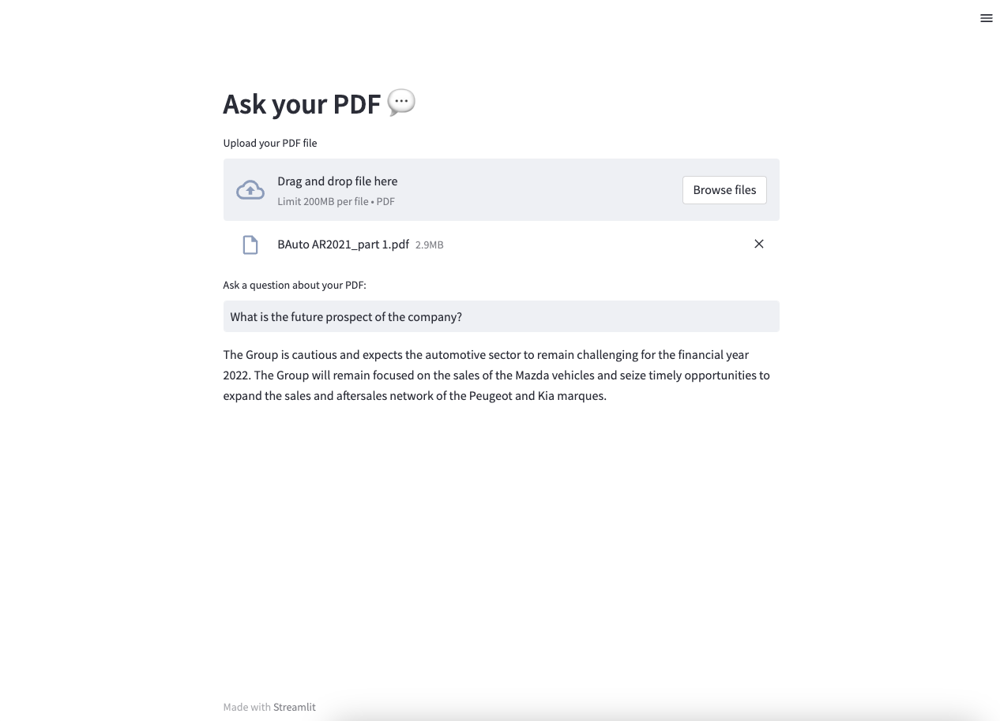

### Summary
This is a simple example of a Q&A app build with langchain and streamlit, powered by GPT-3. It takes a PDF file as an input and answers questions about it.

### How to install
1. Clone this repo
2. Make sure you have `pipenv` installed.
3. Activate the virtual environment with `pipenv shell`
4. Run `pipenv install` to install dependencies.
5. Create `.env` file and place your OpenAI API key there.
6. Run `streamlit run app.py` to start the app.

### How to use
1. Upload a PDF file.
2. Ask a question.
3. Wait for the answer.

### Gotchas 
- The embeddings are not stored or cache, each time a PDF is uploaded, the embeddings are generated again. 
